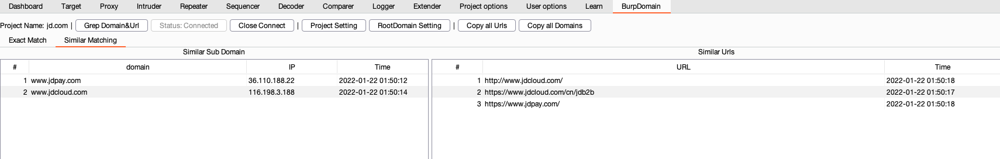
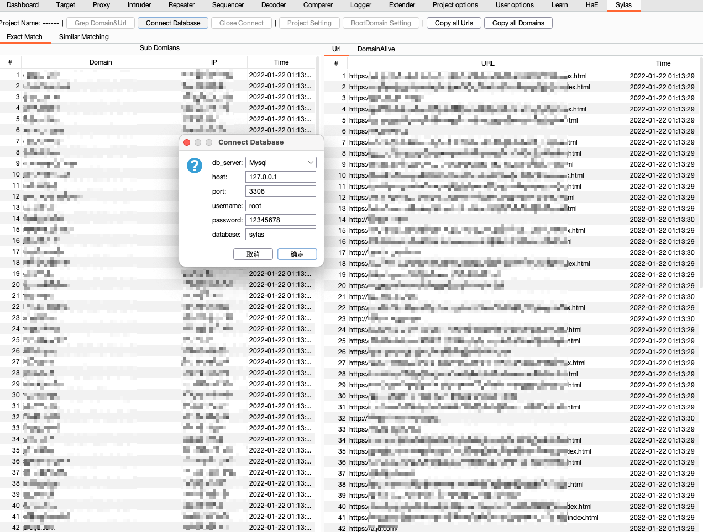
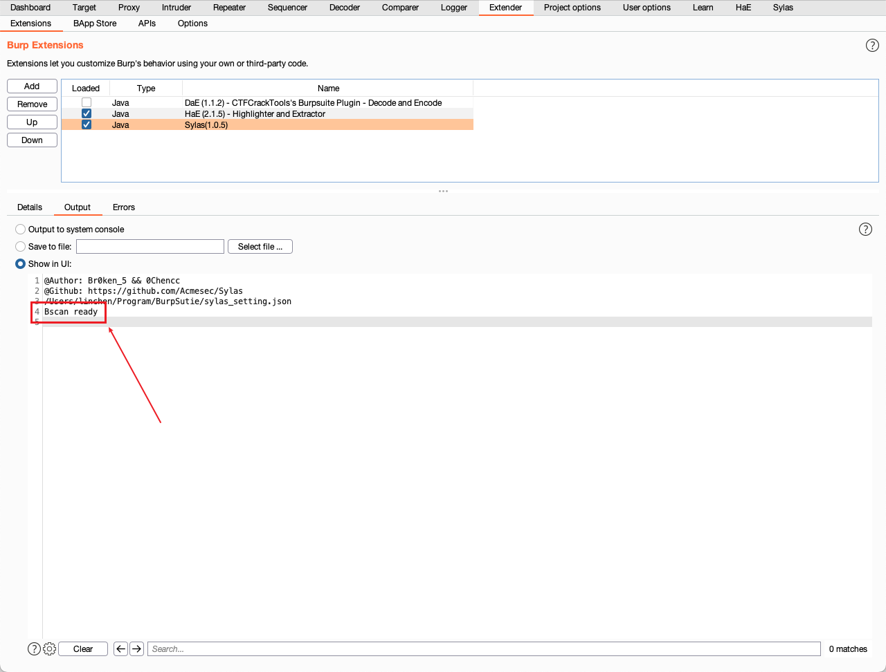
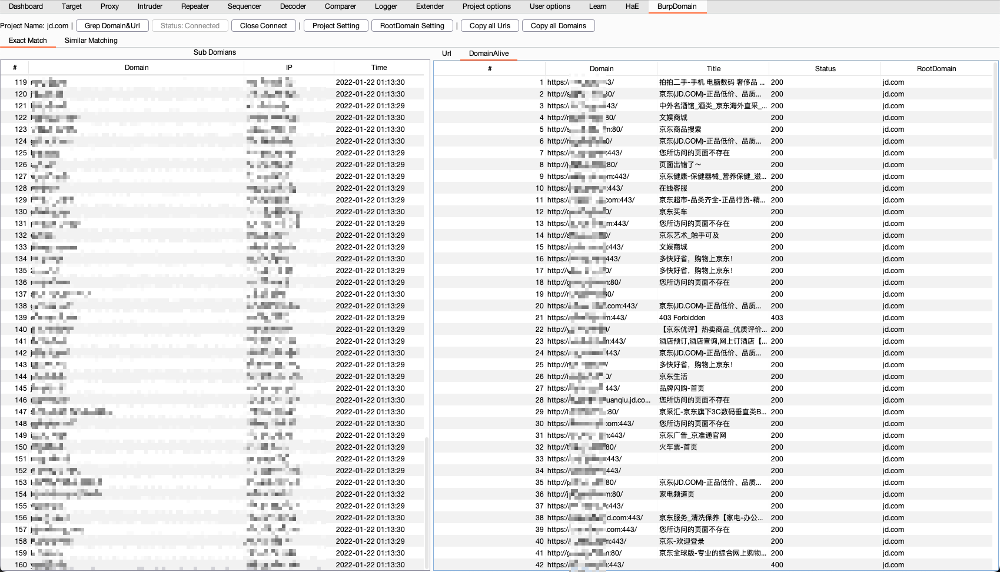
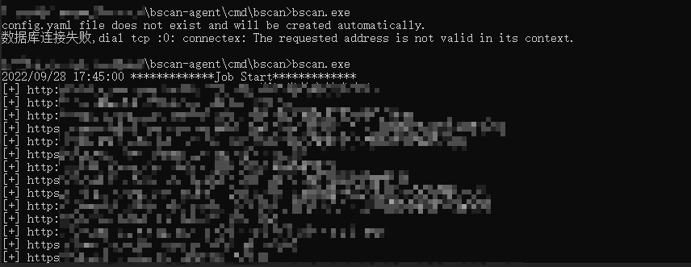
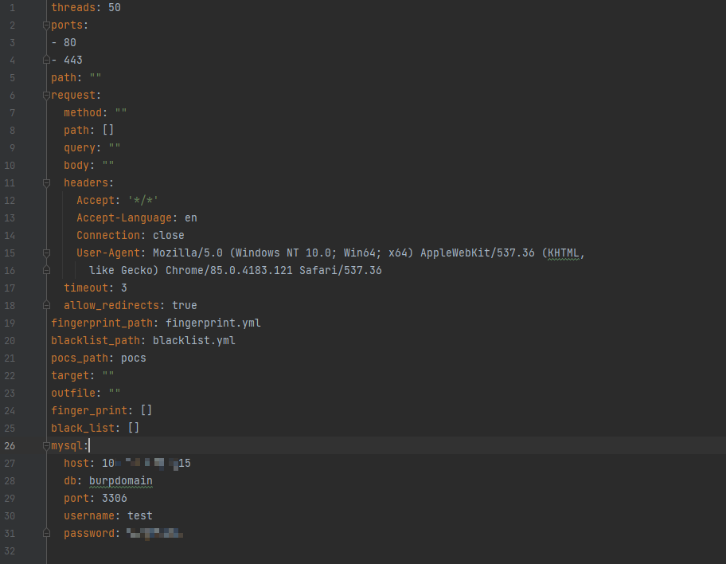

[Chinese](./README.md)|[English](./README_en.md)

# Sylas (Sylas) - a new generation of subdomain collection tools

Former Name: BurpDomain

Author: [@br0ken_5](https://github.com/broken5) && [@0chencc](https://github.com/0chencc)


## project description

Sylas is a hero in one of my favorite games, League of Legends. Under the circumstance that his panel value is already considerable enough, his ultimate skill **HIJACK** can steal the ultimate skills of other heroes for his own use. I think Sylas is very suitable to represent this project. After the basic functions of the plug-in are developed, we will reconsider the possibility of linkage with other projects, and try our best to integrate the existing ideas we have with this project to make Sylas Become an existence that can stand alone on the battlefield. ——Lin Chen[@0chencc](https://github.com/0chencc)


## Thanks

 In the process of tool development, the [domain_hunter_pro](https://github.com/bit4woo/domain_hunter_pro) project of author [@bit4woo](https://github.com/bit4woo) was referenced

## Function

* Active search

After the root domain name is set, all subdomains related to the root domain name will be displayed from historical traffic and stored in the database.

* Passive search

When using the burp proxy, the domain name is captured from the traffic passing through the burp for storage. No need to open, the plugin will be pulled automatically after startup and database connection.

* Similar domain name fuzzy matching

Similar domain names will be matched, and those that conform to the rules will be pulled into the library

* Support mysql/sqlite

We plan to think about the linkage between this tool and other tools in the later stage, so we chose mysql as the database. According to Duck King [@TheKingOfDuck](https://github.com/TheKingOfDuck), we added Sqlite as support. Currently, Sqlite is used by default as the database to reduce the cost of use for users.

* Linkage with Bscan

This part is what I call the Mysql linkage. In the current version, BurpDomain will support regularly pulling [Bscan] from the Mysql database every 1 minute (https://github.com/broken5/bscan/tree/sylas) Live data, but the capabilities of [Bscan](https://github.com/broken5/bscan/tree/sylas) are much more than that. I added the ability to skip Bscan to BurpDomain in Todo List.

If you need to support other databases, please give feedback in the issue, I will add it as soon as I receive the feedback.

### TODO LIST

- [x] support sqlite
- [x] fuzzy matching of similar domains
- [ ] url suffix filter
- [ ] Due to the hurry, the readability of the current code is very poor, and the code will be refactored at some time.
- [ ] Bscan miss scanning capability combination

## Instructions

### 0x00 Configuration database

In the current version and all future versions, Sqlite is supported. If you just want to use BurpDomain functions, you only need Sqlite.

If you need to get stronger functions, you need to start the Mysql service, create a database in Mysql, and set the connection configuration of Mysql.


### 0x01 Create a new project

Click the Project Setting button, enter the project name and click add, select it to create a new project

Since the database is used for storage, historical project records will be stored. When running, the project information of the database will be pulled, or you can directly select the continued project.


### 0x02 Add root domain name

Click the RootDomain Setting button to add the required root domain names to be crawled


### 0x03 Domain name collection

If you need to crawl historical traffic, click the grep domains button.

After the configuration is complete, there is no need to perform any further operations. The following is the rendering


### 0x04 Similar domain name collection

Use the following code for similar domain name matching, with regular in it. If you have a better regular, you can submit an issue, and we will adopt it at that time. grateful.

````java
for(String s:BurpExtender.currentRootDomainSet){
  //Idea: Consider cutting the rootdomain, for example, baidu.com is cut into baidu com, and then similarity matching is performed on baidu
  String[] tmp = s.split("\\.");
  //Get the part that needs to be matched by the length of the cut, and use this to avoid the problem that when the user sets the root domain name to www.baidu.com, it will be matched to www.baidu. At present, directly take baidu,com
  String similarRegex = String.format("((?!-)[A-Za-z0-9-]{1,63}(?<!-)\\.)*(?!-)[A-Za- z0-9-]{0,63}%s[A-Za-z0-9-]{0,63}(?<!-)\\.%s",
                                      tmp[tmp.length-2],tmp[tmp.length-1]);
  Pattern similarPattern = Pattern.compile(similarRegex);
  Matcher matcher = similarPattern.matcher(domain);
  return matcher.find();
}
````



### 0x05 Tool Features

The sorting function by fields can quickly filter out intranet IPs, similar network segment IPs, and similar domain names. You can customize the domain name dictionary, blast HOST, etc. according to this information to further expand the scope of information collection.


### 0x06 Linkage with Bscan

#### Sylas configuration

You need to change the way of configuring the database to Mysql, and fill in the configuration as shown in the figure.



This feature will be enabled after both Sylas and Bscan are configured.

After configuring Bscan, you need to reconnect to the Mysql database. Check if Burp-Extender prints out the Bscan Ready string, if it does, the function is enabled.



This function can only be experienced by users who have configured Bscan and Mysql. Currently, only batch website testing is supported, and the effect is as follows.



You need to configure the database information of Sylas in the configuration file of [Bscan](https://github.com/broken5/bscan/tree/sylas), and then start it according to the method in the readme.

#### Bscan configuration

##### 0x00 initialization

```shell
./bscanSylas
````


After executing this command, an error will be reported and a configuration file will be generated

##### 0x01 Modify the Config.yml file

Open the generated Config.yml file

Modify the configuration about the Sylas database in the sylas field.



##### 0x02 start

Start the program directly with nohup, the program will automatically create the required table name in the database at startup
```shell
nohup ./bscanSylas &
````
Then the program will automatically pull the Silas database every 1 minute, and after scanning, the scan results will be stored in the database for Silas to pull.

In the latest version, we have added linkage with Bscan, and we are also looking for the possibility of combining with other tools in the future. The reason why Bscan has never been open source is that Brother B thinks the code is a bit ugly, but this time we open source the code on the branch, and the stronger Bscan will have to wait until the next month to update it.